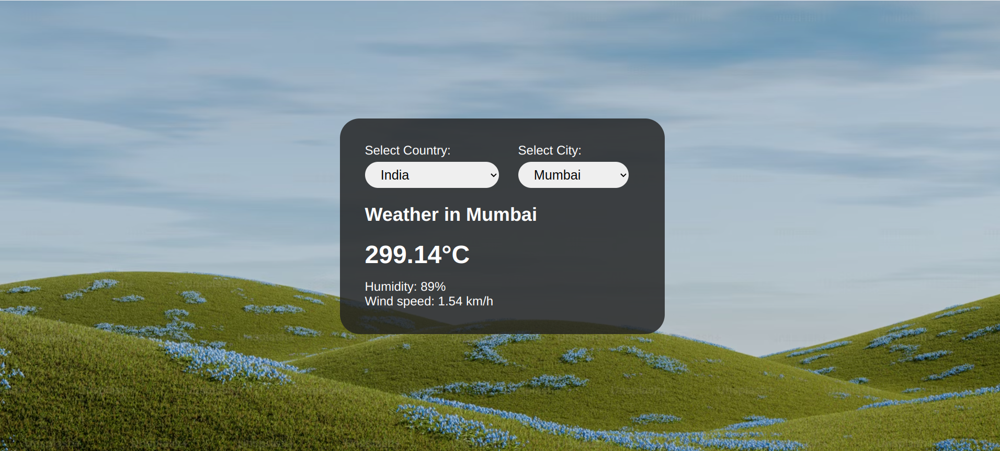

# ⛅ Weather App
<div align="center">

</div>


## ✨ Live Demonstration

The live Weather app site can be [viewed here](https://akweatherapp.vercel.app/)

---


## 🔌 Getting Started
clone the repository on your local machine with the command below in your terminal, and cd into the weather-app folder

```
git clone https://github.com/leader-akash/Weather-app.git

cd weather-app
```

- install dependencies (if you are using **yarn** then do with that)

```
npm install

yarn add
```

- start the server

```
npm run dev
```
